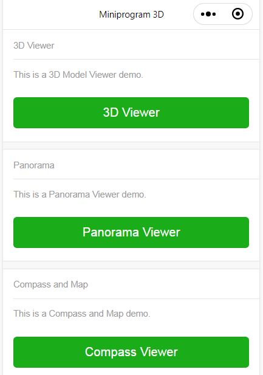
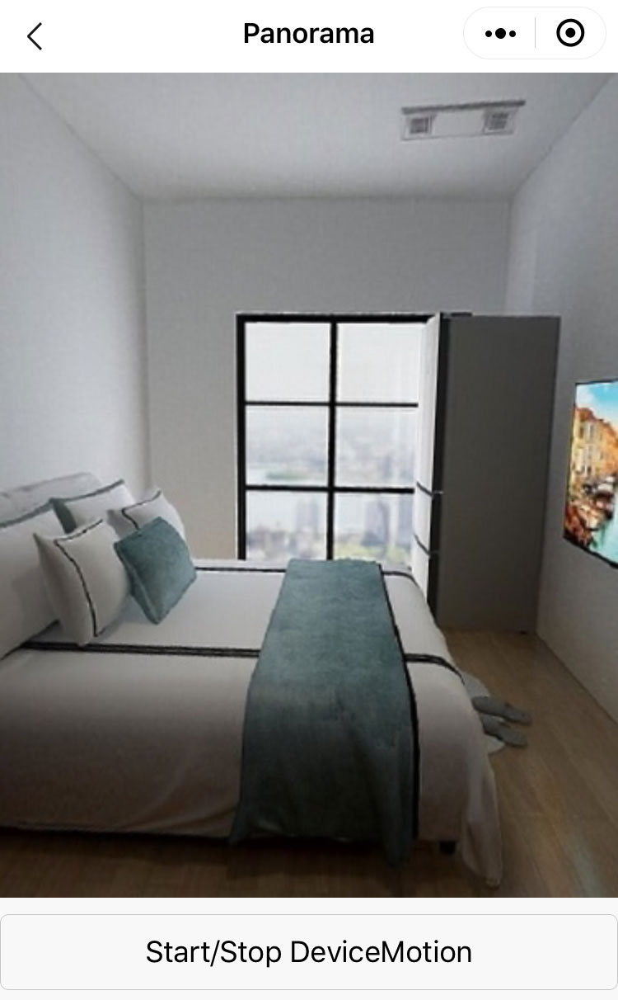
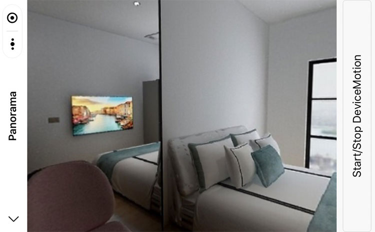
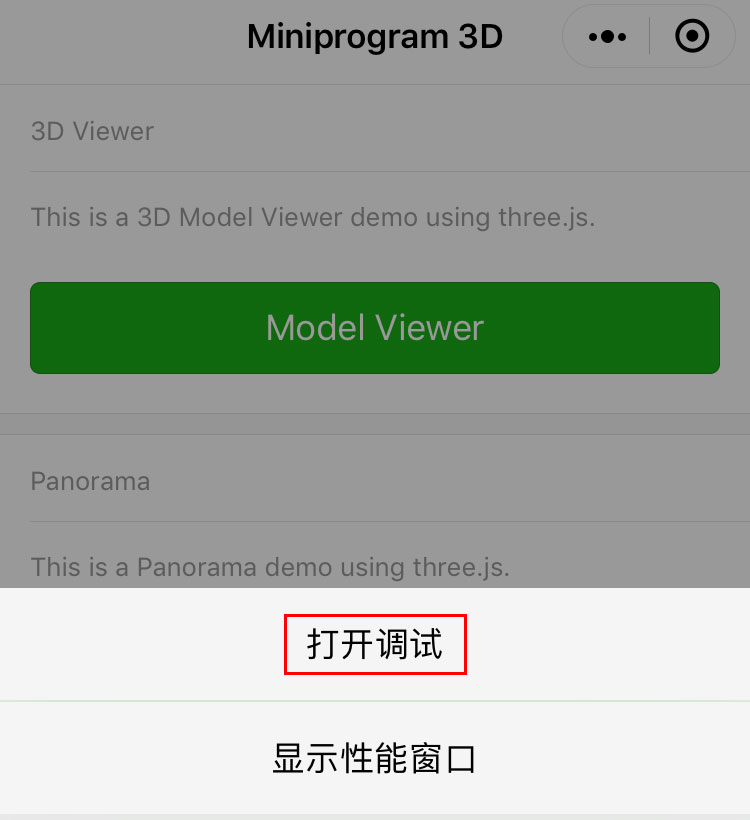
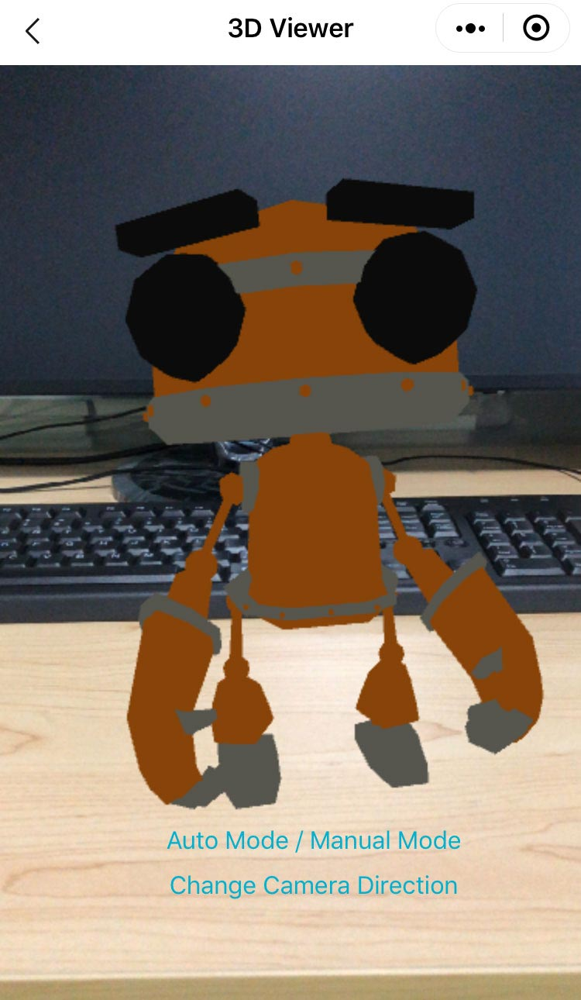
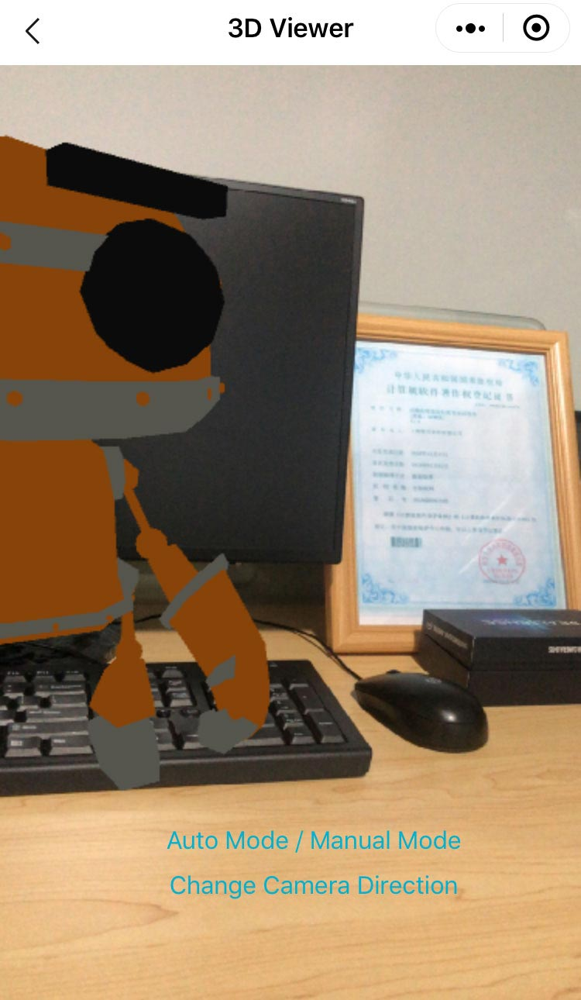
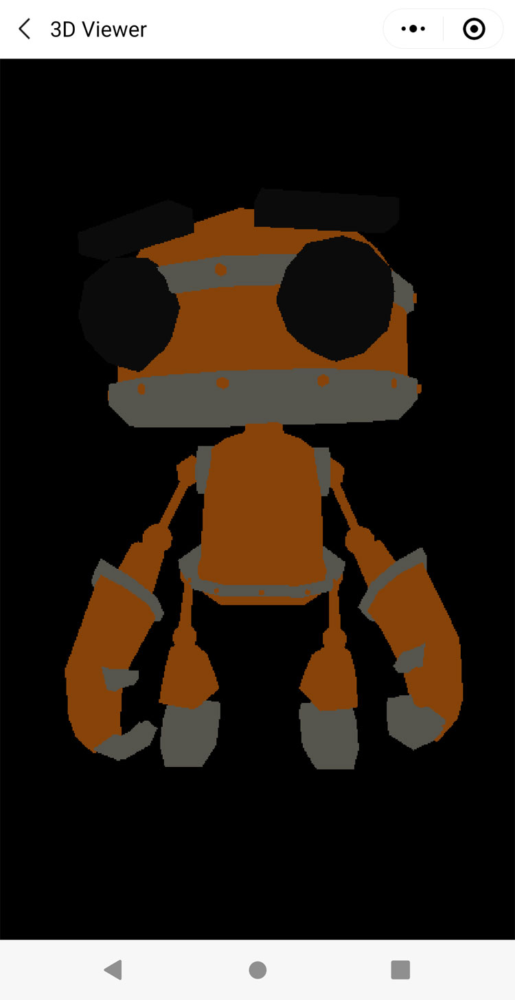

[Chinese README](https://zhuanlan.zhihu.com/p/81636351)  

## Updated

| Date　　　| Update |
| -- | -- |
| 2019-09-17 | New: A WeChat MiniProgram 3D that includes a Panorama Viewer and a 3D Viewer using the device orientation control. |

## Introduction of WeChat MiniProgram 3D with THREEJS

Three.js is a JavaScript 3D library.

[Three.js](https://github.com/mrdoob/three.js)

There is a WeChat MiniProgram adapted version of Three.js.

[threejs-miniprogram](https://github.com/wechat-miniprogram/threejs-miniprogram)
 
Index Page



3D Viewer Page


## Panorama Viewer

When click the "Panorama" button, a panorama viewer will be showed.

portrait screen



landscape screen



When start a device motion, the device orientation control will rotate the screen.

When stop a device motion, use a hand to rotate the screen.

## 3D Viewer

At first, we enable the "打开调试" button. It is used for loading a model.



When click the "Model Viewer" button, a 3D viewer will be showed.



We can rotate the screen by a device orientation control or using my hands.



Note: 3D Viewer on Android Wechat has no the camera background.



## How to build

The Mini-program depends on a "threejs-miniprogram" npm package. 

step 1: npm install

step 2: run "微信开发者工具--工具--构建npm", a folder "miniprogram_npm" will be updated.

The project has included a folder "miniprogram_npm" precompiled.

File: /package.json

```javascript
  "dependencies": {
    "threejs-miniprogram": "0.0.2"
  }
```

## What changes to GLTFLoader.js

You can search a keyword "2019.9.11 modified" in GLTFLoader.js. The search result is a code modified.

For example, added a export of function "GLTF_Loader". Use the function to set the "THREE" object into the "GLTFLoader.js" module.

File: /utils/GLTFLoader.js

```javascript
   // 2019.9.11 modified
   // THREE.GLTFLoader = ( function () {
   export function GLTF_Loader(THREE) {
```
## Set your website url of models

The project includes a gltf model that are depolyed on a website. The default value of parameter "modelUrl" is a website url that may be very slow on your network. You can replace the default url with a web site url.

Download models: https://github.com/sanyuered/sanyuered.github.io/tree/master/gltf

```javascript
    // set your site url of a gltf model
    const modelUrl = 'https://sanyuered.github.io/gltf/robot.glb';
    //const modelUrl = 'http://127.0.0.1/robot.glb';
```
## Known Issues

A part of the demo can not work on Android Wechat. 

The functions disabled on Android are below.

file: /package_3d_viewer/utils/cameraBusiness.js

```javascript
    if (!isAndroid) {
        // init Orthographic Camera
        initBackroundScene();
    }

```

```javascript
    if (!isAndroid) {
        // make the Orthographic Camera and the Perspective Camera work together.
        renderer.autoClear = false;
    }
```

```javascript
    if (!isAndroid) {
        // render for Orthographic Camera
        if (cameraFrame) {
            planeTexture.image = cameraFrame;
            planeTexture.needsUpdate = true;
            renderer.render(sceneRTT, cameraRTT);
        }
    }
```
